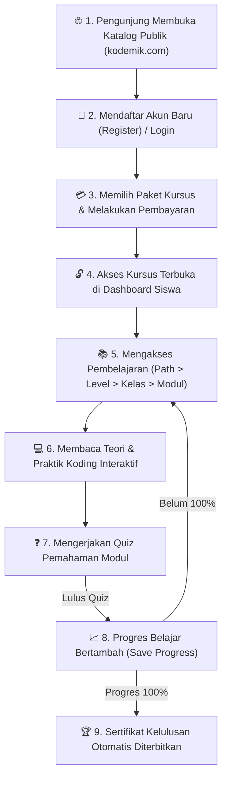

# PLANNING.MD — DOKUMEN PERENCANAAN PLATFORM KURSUS IT (LMS KODEMIK)

Dokumen ini berisi perencanaan strategis tertulis untuk pembangunan platform Learning Management System (LMS) IT **Kodemik** (`kodemik.com`).

---

## 1. Ringkasan Produk (Elevator Pitch)

**Kodemik** adalah platform Learning Management System (LMS) khusus edukasi IT Bahasa Indonesia yang menyajikan jalur belajar terstruktur (Learning Path) berbasis teks interaktif, praktik koding langsung di browser, dan quiz pemahaman. Didesain khusus untuk pemula hingga calon profesional, Kodemik membantu siswa menguasai skill koding industri secara bertahap tanpa perlu instalasi tools yang rumit. Platform ini menawarkan akses kursus berbayar terjangkau dengan fitur pelacakan progres belajar yang presisi hingga sertifikat kelulusan digital otomatis.

---

## 2. Target Siswa (Target Audience)

1. **Pemula & Career Switcher:** Orang yang ingin berpindah karir ke bidang IT (Web Dev, Data Science, Mobile Dev, Cloud/DevOps, Cybersec) tanpa latar belakang Computer Science.
2. **Mahasiswa & Pelajar:** Mahasiswa/siswa SMK yang membutuhkan materi pendamping kuliah/sekolah yang aplikatif dan berbasis kurikulum industri nyata.
3. **Junior Developer / Tech Worker:** Praktisi yang ingin memperdalam skill spesifik (upgrade skill) sesuai bidang yang diminati secara terstruktur.

---

## 3. Daftar Fitur: MVP (Minimum Viable Product) vs. Fase 2

### 🚀 Fitur Fase MVP (Minimum Viable Product — Siap Rilis)
1. **Katalog Kursus Publik:** Halaman depan SEO-friendly yang dapat diakses publik tanpa login untuk melihat gambaran umum 5 Learning Path, silabus kelas, dan harga.
2. **Sistem Pendaftaran & Autentikasi Siswa:** Form daftar akun baru, login, dan pengamanan sesi siswa.
3. **Sistem Pembayaran & Access Enrollment:** Siswa memilih paket kursus dan mendapatkan akses penuh ke materi setelah pembayaran terkonfirmasi.
4. **Player / Tampilan Materi Terstruktur:** Tampilan pembelajaran dengan alur hirarki `Learning Path > Level > Kelas > Modul > Submateri/Praktik`.
5. **Progress Tracking (Pelacak Progres):** Menghitung dan menyimpan progres belajar siswa secara presisi (persentase kelulusan, modul yang telah diselesaikan).
6. **Quiz & Evaluasi Per Modul:** Soal pilihan ganda interaktif di akhir setiap modul untuk menguji pemahaman sebelum melanjut ke modul berikutnya.
7. **Sertifikat Kelulusan Digital Otomatis:** Pembuatan sertifikat PDF/Digital berlisensi resmi Kodemik secara otomatis saat progres belajar mencapai 100%.

### 🔮 Fitur Ditunda ke Fase 2 (Pengembangan Lanjutan)
1. **Forum Diskusi & QnA Interaktif:** Tempat tanya jawab dan diskusi antar siswa dan mentor per modul.
2. **Payment Gateway Otomatis (Midtrans / Xendit):** Pembayaran otomatis via Virtual Account, QRIS, & E-Wallet dengan konfirmasi webhook instan.
3. **Fitur Live Code Sandbox Server Lanjutan:** Code runner multi-bahasa berbasis server container (Docker isolation).
4. **Sistem Gamifikasi & Leaderboard:** Badge pencapaian, streak belajar harian, dan poin reputasi siswa.

---

## 4. Struktur 2 Lapis Pengguna (User Roles)

### 👨‍💼 1. Admin (Pemilik Kursus / Pengelola)
- Mengelola & mengunggah data kurikulum (Learning Path, Kelas, Modul, Materi, Quiz).
- Mengelola data siswa terdaftar & verifikasi akses pembayaran.
- Memantau statistik pendapatan & progres kelulusan siswa secara keseluruhan.

### 🎓 2. Siswa (Peserta Kursus)
- Membuka katalog publik dan mendaftar akun baru.
- Melakukan pembayaran/enrollment kursus.
- Membaca materi terstruktur, menjalankan praktik koding di browser, dan mengerjakan quiz per modul.
- Memantau persen progres belajar pribadi di Dashboard Siswa.
- Mengunduh sertifikat kelulusan digital setelah menyelesaikan 100% materi.

---

## 5. Alur Pengguna (User Flow Siswa)

---

## 6. Rekomendasi Tech Stack MVP (Ringan, Cepat & Bebas Biaya Mahal)

1. **Frontend:** **HTML5, CSS3 Modern, JavaScript (Vanilla SPA / Next.js)**
   - *Alasan:* Sangat ringan, SEO-friendly, waktu muat (loading) instan, dan mudah dirawat.
2. **Backend API:** **Node.js + Express.js**
   - *Alasan:* Ringan, performa I/O tinggi, dan mudah diintegrasikan dengan database apa pun.
3. **Database & Autentikasi Cloud:** **Supabase (PostgreSQL Cloud + Supabase Auth)**
   - *Alasan:* Gratis, menyediakan database PostgreSQL cloud berkinerja tinggi, sistem Auth bawaan aman, serta API realtime.
4. **Hosting & Deployment:** **Vercel**
   - *Alasan:* Gratis, integrasi otomatis dengan GitHub repository, SSL gratis, dan CDN global super cepat.
